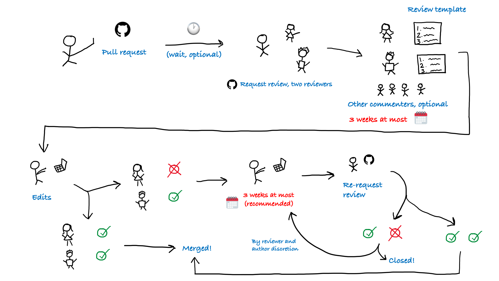

# Introduction

Articles posted to the Janelia Data Standards website should be vetted, authoritative, well-considered, and of high stylistic and technical quality. For this reason, each new article will undergo a review, using GitHub’s PR and review tooling. This process is intended to help the reviewer refine their ideas.

# Review process

Each new article must be approved by at least two reviewers. Reviewers must complete all *three* sections of the template below. Reviewers are selected by the author. The author may select more than two reviewers, if desired, but only the approval of two reviewers is needed. The review *may* consist of in-line comments, but it *must* include the template. 

Anybody who wishes to give feedback on the PR may do so, and the author is encouraged to consider all feedback thoughtfully, whether it comes from casual commenters or official reviewers. There is no deadline between initial submission of the PR and assignment of reviewers. If the author wishes, they may submit the PR, wait a while, see who comments on it, and then invite the commenters to review.

Each reviewer must respond to each of the three template prompts, but each response could be one sentence, one paragraph, or more. Reviewers have **three weeks** to complete their review. There is no minimum timeframe for which the PR must be open--the review process could be done in a day if the author and reviewers act promptly. If a reviewer takes more than three weeks, it is up to the authors’ discretion whether they wish to give the tardy reviewer more time, or select a new reviewer.

If either reviewer requests changes, the author should not spend more than 3 weeks addressing reviewer feedback. This is a soft deadline, as some reviews may require intensive work. The author should address every reviewer comment, but need not implement all of them. In other words, if the author does not want to implement the recommended change, they should explain why. Ultimately, all that matters is that the template is filled out, and two reviewers must ultimately approve the article. Reviewers are encouraged to be reasonable and understand that not all of their comments will be heeded.  

If an article fails to achieve the approval of two reviewers in a reasonable time frame, the PR will be closed. (Who decides this, and how, will be played by ear.) The author may wish to re-submit a modified version of the article. Authors are discouraged from simply re-submitting the same article with more agreeable reviewers. In the event of disagreement on a data standard, the disagreeing parties are encouraged to meet—preferably over food and drink—and have one or more in-person discussions to try and achieve consensus. If consensus is simply impossible, the disagreeing parties should each write an article arguing for their position. The two articles should link to each other on the website, and should respond to each other’s ideas.

Here is a diagram illustrating the review process.

---

# Review template

The questions below do not need to be answered line-by-line. They are not a checklist; rather, they are meant to guide the reviewer in their subjective evaluation of the article's quality. It is up to the reviewer to decide how thoroughly they wish to address each section.

## 1. The Big Picture

Is this article appropriate for the Janelia Data Standards project? 
1. Yes
2. No
3. Comments: ...
Is the general premise of the article sound?
1. Yes
2. No
3. Comments: ...
Is the proposed data standard generalizable beyond that author’s particular use case?
1. Yes
2. No
3. Comments: ...

## 2. Technical Choices

Is the proposed standard elegant, straightforward, and focused?
1. Yes
2. No
3. Comments: ...
Does the author adequately explain the rationale behind the standard?
1. Yes
2. No
3. Comments: ...
Is the author making any flawed implicit assumptions, either about the problem or about their audience?
1. Yes
2. No
3. Comments: ...
Does the author provide an implementation and/or example data (preferable but not required)?
1. Yes
2. No
3. N/A
4. Comments: ...

## 3. Writing Style

Is the post readable to bio-imaging developers who may come from a different sub-field, or code in a different language? Does it contain any typos or awkward sentences? Are the ideas organized in a logical flow?

---

# Modifying existing articles

Ideas and standards evolve over time, so some articles will need to be modified after publication. The modification history will be noted clearly on the post itself, so that no modification will be silent.

If the author is making a *minor* modification to their own article, they may skip the review process. A minor modification does not change the audience or the use case for the standard, and poses no danger of rendering existing implementations of the standard obsolete.

If the author is making a moderate or significant modification to their own published article, they must submit a new PR, and the PR will undergo the same review process described above.

The line between ‘minor’ and ‘moderate’ modifications will be fuzzy. For example, altering a standard to be more permissive may not pose a danger of rendering existing implementations obsolete, but the author may wish to submit it for review anyway. These judgment calls are up to the author.

Anyone may modify *any* article, even one they didn’t write, subject to the following condition: **any modification—even a minor one—requires the modifier to reach out to the original author.** Beyond that, the procedure then depends on the size of the modification:

- Minor modifications only require a quick assent from the original author. If person A wrote the original article, and person B wishes to make a minor modification, then person B should reach out to person A. If person A replies, ‘go ahead’, then no further review is necessary.
    - If the original author cannot be reached, then minor modifications can be made with no review.
- Moderate or significant modifications require formal review. In these cases, the modifier must make a good-faith effort to invite the original author to be a reviewer. If the original author wants to review, then the new author must select them as a reviewer. If the original author can’t be reached, then the article can be modified without their consent, with the usual review process.

---

# Implementation in GitHub

When the author is ready to submit their PR for review, they must use GitHub's [Request Review](https://docs.github.com/en/pull-requests/collaborating-with-pull-requests/proposing-changes-to-your-work-with-pull-requests/requesting-a-pull-request-review) feature to assign TWO reviewers to the PR. Some instructions for reviewers are available [here](https://docs.github.com/en/pull-requests/collaborating-with-pull-requests/reviewing-changes-in-pull-requests/reviewing-proposed-changes-in-a-pull-request).

On GitHub, a review has three possible statuses (or no status, e.g. pending reviewer response):
- Comment: Submit general feedback without explicitly approving the changes or requesting additional changes.
- Approve: Submit feedback and approve merging the changes proposed in the pull request.
- Request changes: Submit feedback that must be addressed before the pull request can be merged.

Reviews-in-progress should have no status or "Comment" status. A status of "Approve" or "Request Changes" indicates that the reviewer has made their choice, and the status must not be changed after that. Reviewers have at most three weeks to select either "Approve" or "Request Changes".

If either reviewer requests changes, the author should implement those changes as described above, and then [re-request review](https://i.sstatic.net/H2XaO.gif).

Note: All authors and reviewers should have write access to the repository. Write access is required to assign reviewers, and while GitHub does not require write access to leave reviews, a merge can proceed without approval from a read-only reviewer. For this reason, DSG authors and reviewers should request write permissions from the repository owner(s).

---

# Attribution of Roles

Contributions to the Data Standards project can be categorized in five roles:
* Author(s) - Wrote the article or made a major modification to the article
* Reviewer(s) - Reviewed the article or reviewed a major modification to the article
* Contributor(s) - Commented on a draft of the article or provided minor modifications
* Endorser(s) - Agree with the article's recommendations
* Maintainer - Party to whom correspondence should be addressed

People who contributed in each of these roles should be added to the post metadata using the template provided. (See previous posts for examples.) Endorsers may be added at any time, and endorsers should feel free to add themselves with no review process. 
